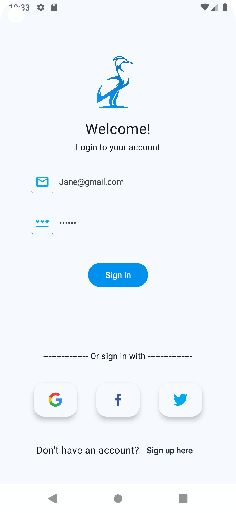

# FireChat
FireChat is a chat based on Firebase.

The project tries to combine popular Android tools and to demonstrate best development practices by utilizing up to date tech-stack like Compose, Kotlin Flow and Hilt.

## Description

A Clean Architecture App to show use of  multi-module-architecture in a Jetpack Compose.

The modules are as follow:

* features: Presentation Layer

* domain: Business Logic Layer

* data: Data Access Layer

* utils: Extension And UI Layer

## Images

## Tech Stack

* Multi-Module-Architecture
* [Kotlin](https://kotlinlang.org/) 100% coverage
* [Jetpack](https://developer.android.com/jetpack)
  * [Compose](https://developer.android.com/jetpack/compose)
  * [Navigation](https://developer.android.com/topic/libraries/architecture/navigation/) for navigation between composables
  * [ViewModel](https://developer.android.com/topic/libraries/architecture/viewmodel) that stores, exposes and manages UI state
  * [Type safe navigation] (https://developer.android.com/guide/navigation/design/type-safety)
* [Firebase](https://firebase.google.com)
  * [Storage](https://firebase.google.com/docs/storage)
  * [Realtime Database](https://firebase.google.com/docs/database) 
  * [Authentication](https://firebase.google.com/docs/auth) 
  * [Cloud Messaging (FCM)](https://firebase.google.com/docs/cloud-messaging) 
* [Material Design](https://m3.material.io/)
* Scan Bar Code
* [Hilt](https://developer.android.com/training/dependency-injection/hilt-android) for dependency injection
* [Coroutines](https://kotlinlang.org/docs/reference/coroutines-overview.html) and [Flow](https://developer.android.com/kotlin/flow) for async operations
* AndroidX
* [Retrofit](https://square.github.io/retrofit/) for networking
* [Coil](https://github.com/coil-kt/coil) for image loading
* Solid Principles

## Presentation patterns layers
* View - Composable screens that consume state, apply effects and delegate events upstream.
* ViewModel - [AAC ViewModel](https://developer.android.com/topic/libraries/architecture/viewmodel) that manages and set the state of the corresponding screen. Additionally, it intercepts UI events as callbacks and produces side-effects. The ViewModel is scoped to the lifetime of the corresponding screen composable in the backstack.
* Model - Data source classes that retrieve content. In a Clean architecture context, one could use UseCases or Interactors that tap into repositories or data sources directly.

## Did you find this repository helpful?
Don't forget give a star.
